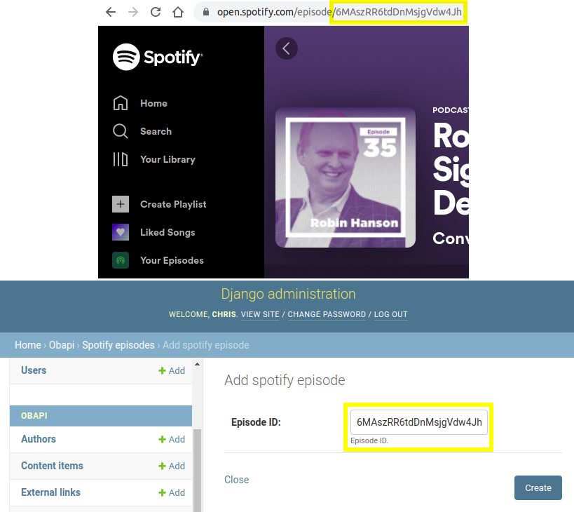

Installation and Getting Started
================================

**Supported Python Versions**: 3.8+

**Supported Platforms**: Linux, Windows, MacOS

This page explains how to install django-overcomingbias-api and run some basic commands.

Installation
------------

Install ``django-overcomingbias-api`` and its dependencies from
`PyPI <https://pypi.org/project/django-overcomingbias-api/>`_

.. code-block:: console

    $ pip install django-overcomingbias-api

Add the project requirements ``django-ordered-models`` and ``obapi`` to your installed
apps:

.. code-block:: python

    # settings.py

    INSTALLED_APPS = [
        ...
        # Optional (admin integration)
        "django.contrib.admin",
        "django.contrib.auth",
        "django.contrib.contenttypes",
        "django.contrib.sessions",
        "django.contrib.messages",
        # Required
        "ordered_model",
        "obapi",
        ...
    ]

    # Optional setting - controls number of overcomingbias posts to hold in memory while
    # downloading
    # OBAPI_DOWNLOAD_BATCH_SIZE = 1000

Last, run the migrations

.. code-block:: console

    $ python manage.py migrate

All done!

Basic usage
-----------

The easiest way to use the app is through the
`Django admin site <https://docs.djangoproject.com/en/dev/ref/contrib/admin/>`_.

Setup
*****

To initialise a database of all overcomingbias posts, use the "pull" button:

The "pull" button adds all new posts to the database, and the "sync" button updates any
posts which were modified since the last update.

To add YouTube and Spotify content, use the identifiers found in their URLs.
For example:

You can also overcomingbias posts individually, but this is not recommended, as it will
interfere with "pull" and "sync" functionality.

Managing Data
*************

``ContentItem`` is the base class for all content.
Overcomingbias posts are represented by the subclass ``OBContentItem``.
Similarly, YouTube and Spotify content is represented by the ``YoutubeContentItem`` and
``SpotifyContentItem`` subclasses.

To provide rich but flexible classification (groupings) of content, three types of
"classifiers" are used: ``Tag``\ s, ``Idea``\ s and ``Topic``\ s.
``Idea`` classifiers represent specific ideas (e.g. "prediction-markets"), ``Topic``
classifiers represent general topics (e.g. "institutions"), and ``Tag`` objects represent
anything else (i.e. arbitrary metadata about the content).

When adding content:

- Initially, posts and other content are categorised using only ``Tag``\ s.

- To merge a set of ``Tag``\ s / ``Idea``\ s / ``Topic``\ s, use the ``Merge Objects``
  admin action.

- To convert a classifier to another type (e.g. convert a ``Tag`` to a ``Topic``),
  use the ``Convert selected items to ...`` admin action.

Posts often contain hyperlinks to other posts (or other content):

- These links are initially represented as ``ExternalLink`` objects (basically just a
  URL).

- To convert these links into ManyToMany relations on the content objects,
  use the ``Internalize Links`` admin action.

- To remove any ``ExternalLink``\ s which are no longer referenced,
  use the ``Delete Unreferenced Links`` admin action.

.. Sequences

Using Data
**********

To use the data, you can

- Provide your own Django views on top of the database

- Use the GraphQL or REST API and build a frontend in whatever framework you like

